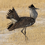
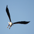
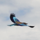
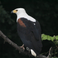
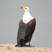

|         | English  | Deutsch    |
| ------- | -------- | --------- |
|  | [Birds of Botswana](apps/birds-botswana/en) | [Vögel von Botswana](apps/birds-botswana/de) |
|  | [Birds of Namibia](apps/birds-namibia/en) | [Vögel von Namibia](apps/birds-namibia/de) |
|  | [Birds of South Africa](apps/birds-southafrica/en) | [Vögel von Südafrika](apps/birds-southafrica/de) |
|  | [Birds of Zambia](apps/birds-zambia/en) | [Vögel von Sambia](apps/birds-zambia/de) |
|  | [Birds of Zimbabwe](apps/birds-zimbabwe/en) | [Vögel von Simbabwe](apps/birds-zimbabwe/de) |
